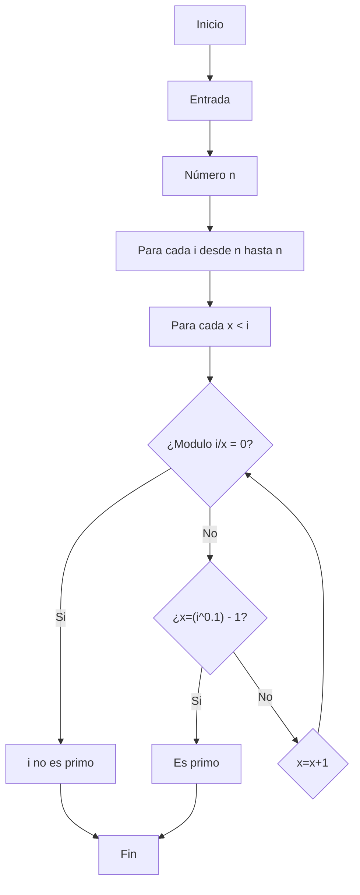

# Reto #3 
## Lista de contenidos
1. [Hallar números primos](#hallar-números-primos)
      - [Pseudocodigo](#pseudocódigo-primos)
      - [Flowchart](#flowchart)
2. [Hallar raiz de n](#hallar-raiz-de-n)
      - [Pseudocódigo](#pseudocódigo-raiz)

# Hallar números primos
## Pseudocódigo primos 
```pseudocode
[variables]
n: natural
i: natural
x: natural

Inicio
n = entrada (“Ingresar número natural”)

  Para Cada i desde 2 hasta n Hacer 
  	x < i 
  	Para Cada x Hacer
  		Si modulo (i,x) = 0 Entonces 
  			Imprima (i “No es primo”)
  		Sino si x = (iˆ0.5)-1 
  			Imprima (i “Es primo”) 
  		Sino 
  			x = x + 1 
  		Fin si
  	Fin Para Cada
  Fin Para Cada 
Fin 

```
## Flowchart


# Hallar raiz de n

## Pseudocódigo raiz
```pseudocode
Variables]
n: Entero positivo
c: real positivo 
Inicio
n = entrada (“Ingrese número para calcular raíz (entero positivo)”)
Separar n en grupos (g) de 2 en 2 hasta final de n de derecha a izquierda 
g1 = Primer g de derecha a izquierda 
Buscar c tal que cˆ2 se acerque a g1 
r = g1-(cˆ2) 
Repetir
	bajar siguiente g a r
	m = c*2 
	buscar x tal que 
		mx = poner x al lado derecho de m
		mx * x ≈ residuo 
		cx = poner x al lado derecho de c 
	nr = r – (mx * x) 
	c == cx
	r == nr 
Hasta que [cˆ2 = n ] 
Fin
```

