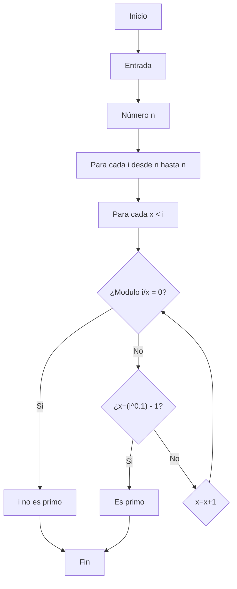

# Reto #3 
## Lista de contenidos
1. [Hallar números primos](#hallar-números-primos)
      - [Pseudocodigo](#pseudocódigo-primos)
      - [Flowchart](#flowchart)

# Hallar números primos
## Pseudocódigo primos 
```pseudocode
[variables]
n: natural
i: natural
x: natural

Inicio
n = entrada (“Ingresar número natural”)

  Para Cada i desde 2 hasta n Hacer 
  	x < i 
  	Para Cada x Hacer
  		Si modulo (i,x) = 0 Entonces 
  			Imprima (i “No es primo”)
  		Sino si x = (iˆ0.5)-1 
  			Imprima (i “Es primo”) 
  		Sino 
  			x = x + 1 
  		Fin si
  	Fin Para Cada
  Fin Para Cada 
Fin 

```
## Flowchart

